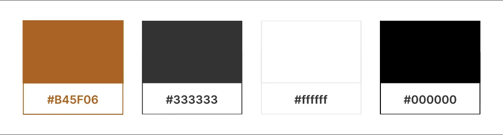
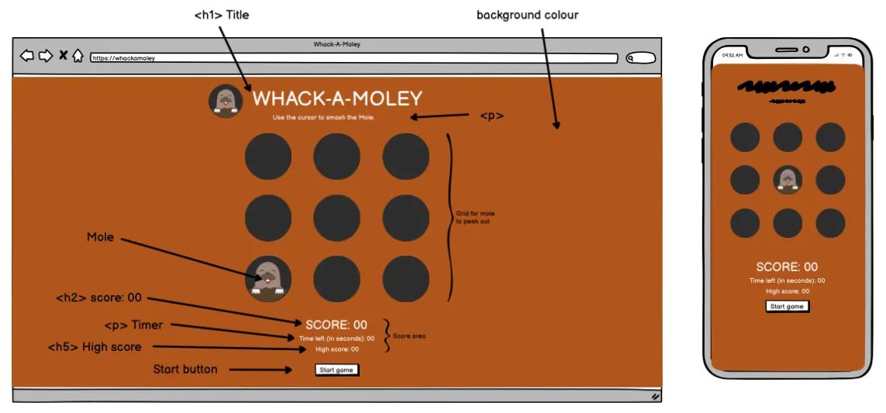
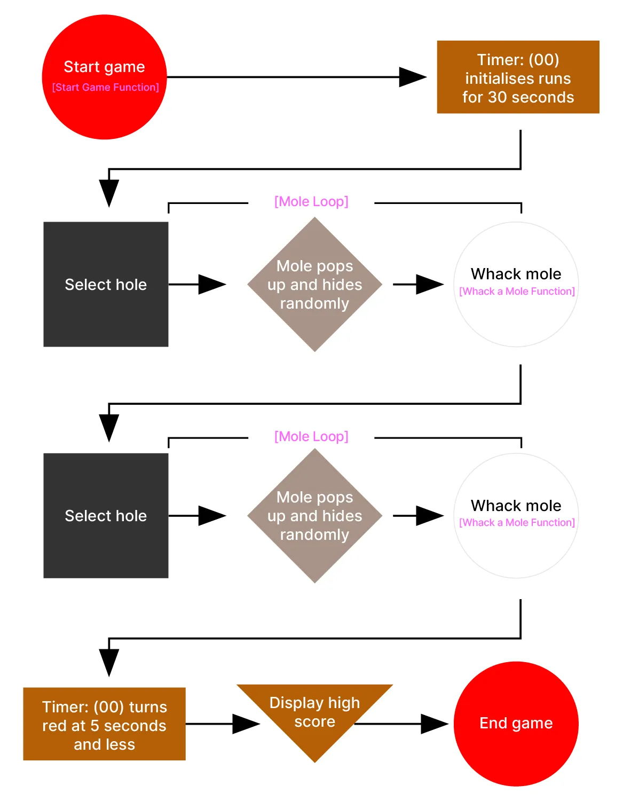
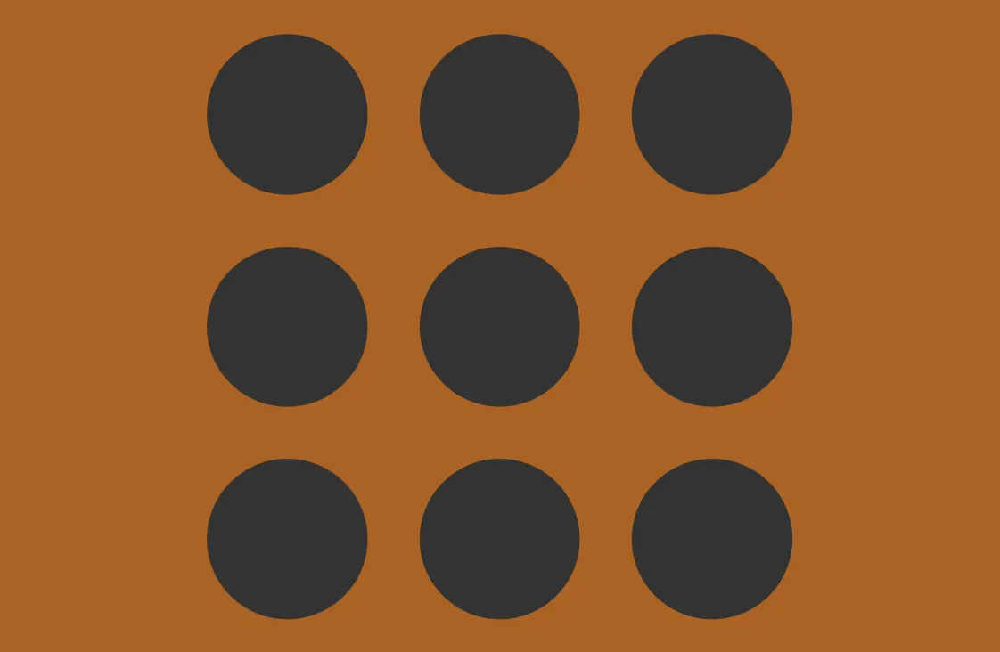

# Whack-A-Mole

This is a classic game which allow the user to test their eye and hand coordination skills. The game is intended for all demographics (ages 5-80 years) as it is fully intuitive, fun and easy to navigate and play. The webiste is fully responsive and shows how javascript is used to create an interactive game experience.

 

[You can view this website here](https://reubes77.github.io/whack-a-mole/)

----

## Design

### Creative Rationale
As human beings, it is imperative to be active for the benefit of health and mind well-being. Regular exercise, healthy nutrition and a sharp mind are all elements to living a balanced life.

The most unnoticed and first form of exercise which all humans start off with at a very young age is the ability to practice eye and hand coordination. A baby picks up an object, touches it, tastes it and throws it and the action is repeated. this simple task is the fundamental building blocks of hand eye corrdinitation. This is the most basic form of exercise and as we grow up unto adults, we tend to not exercise certain muscle. Today, this exercise is used in all basic training from Football to Formula One, where athletes are using this exercise in their regular training regimes.

This is the inspiration for my idea for project 2. I wanted to create a game that is fun, interactive and Whack A Mole is a old classic game which was a ideal to exercise hand and eye coordination.

### Color scheme

This game is meant to be fun and I wanted a color that best represents that essence and I chose to use the color Orange. The second colour to complement and contrast against the Orange is White as it also allows for easy readibility. Below is a breakdown of the colors and their usage. An accent color of Dark Grey which represents mystery and is used to compliment the design and used minimally.

  - #f96d00 (Orange) used as background color.

  - #ffffff (White) used for all text.

  - #333333 (Dark Grey) used for the holes.

 

### Typography

  [fonts.google.com](https://fonts.google.com/) was used to help generate the font as follows:

  - Inter was used for the all text in the game.
  - Inter was selected because it is a sans serif and compliments the purpose of the game. 
  - It is also a readable and clear font.

  * Font Awesome icon was used for the tab icon in the browser.

### Website wireframe (created on Balsamiq):

Before I started designing the website, I went to the drawing board to map out the design structure. 
I used Balsamiq to create a wireframe of the website.

### Game function wireframe:

Before I started designing the website, I went to the drawing board to map out the design structure. 
I used Balsamiq to create a wireframe of the website.

 

----

## Features

The project consists of basic functions to operate and include the following:

### Header

 

The header consists of the logo which depicts our mole and the name of the game, Whack A Mole!

### Instruction

 

A paragraph gives the user instruction on the method in which to play the game.

### Game Arena

 

The game arena is the dedicated area which consists of circles which represents holes through which the mole appears and disappears.

### Score Area

#### Feedback message:

 

Indicates that the game is over and shows the user's their final score with the message - "Game Over! Your final score is:". If the user scored higher than the high score, then the message shows "Game Over! New High Score:".

#### Score:

 

The game area contains the score (shows the user's score after completing game), the timer (counts down the time for user to complete the game) and high score (shows the user the high score to beat).

#### Timer:

 

The timer counts down the time from 30 seconds in which the user needs to whack as many moles as they can. Once the timer reaches 5 seconds, the color will change to crimson to indicate that time is almost up.

#### High Score:

 

Indicates the user's highest score and records it to the local storage.

## Start button

 

This allows users to start a new game.

## Technologies used:

  - HTML
    * Page markup.

  - CSS
    * Styling.

  - Javascript
    * Running functions for interactive components.

----

## Testing

Manual testing:

  - CSS - media queries tested to see responsiveness and picked up issues on screens with min-width (600px and down - 1200px and up). These issues were resolved through Chrome Devtools as well as checking responsiveness on Am I Responsive website.

> [!NOTE]  
> For all testing, please refer to the [TESTING.md](TESTING.md) file.

----

## Bugs

### Fixed bugs:

 - The alert message popped up with clicking the start game button. The bug was fixed by deleting the eventListener for endGame(); in the // Attach start game to button.

 - The alert message "Game Over! Yout final score is 00." popped up before the game started. This was fixed by changing the message to feedback on the game-arena screen above the score area.

  - Syntax Error: The line messageElement.style.display = "block"; Show game over message did not contain the //. Fixed issue with add // in front of the description.

  - Moles stopped popping up after a Level to Display difficulty function and a function to update Level Display was included to add a challenge for users playing this game. The fix was to declare the const levelDisplay = document.getElementById("level"). This allowed the moles to pop up as expected.

  - Bug occured where the score did not reflect the "Game Over" message. Once the time ran out, a mole popped up again which was an error, and if the user mistakenly clicked on it, then the scores were different. 

### Unfixed bugs:

----

## Deployments

  The website was deployed via Github pages. The following steps were used to deploy this website:

    - In the Github repository, navigate to the Settings Tab, under the Code & automation section, click on the Pages Tab.
    
    - Under the Build and Deployment section, select the Source section drop-down menu, then select the Master Branch.

    - Once the Master Branch has been selected, click on the Branch drop-down menu and select Main tab and then click Save.
    
    - Go back to the Code tab and on the right-hand side, click on the Github pages under the Deployments section.
  
    - Under the Github-Pages Deployments section, click on the link to the completed website.

The live link can be found [here:](https://reubes77.github.io/whack-a-mole/)

## Credits

### Content

1.  Resource for checking how to write code syntax and functions for creating the code to make game work:

    - [MDN] (https://developer.mozilla.org/en-US/docs/Web/JavaScript/Reference)

    - [w3schools] (https://www.w3schools.com/js/default.asp)

2. The code to make timer color change when reaching 5 seconds:
    
    - [Stack Overflow] (https://stackoverflow.com/questions/31298941/anyway-possible-to-make-a-countdown-timer-change-color-at-an-certain-time-with-j/31299299)

    - [Dev Drawer] (https://www.youtube.com/watch?v=WGekurbM1Hg)

3.  My mentor Rory Sheridan for his advice and guidance on how to debug the code, create a feedback message on the page instead of an alert message and add a level of difficulty to the game.

### Media

  1. Vector illustration sourced from [vecteezy.com](https://www.vecteezy.com/)

