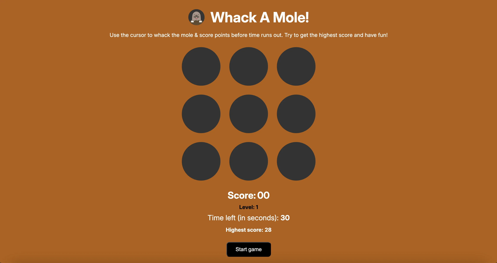
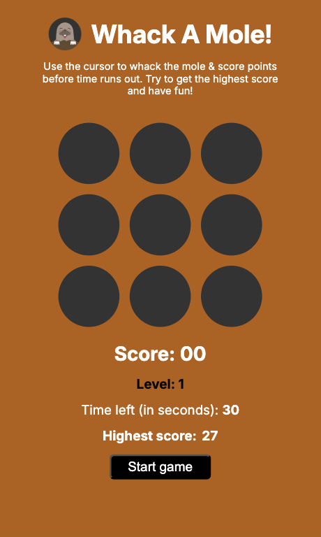
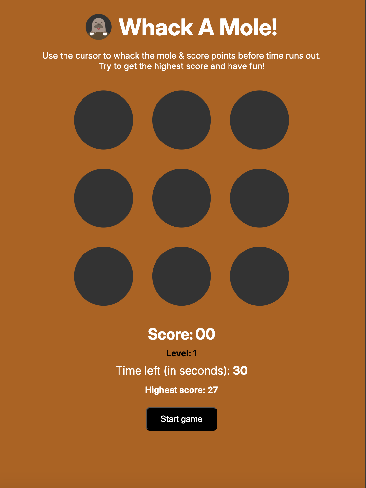

# Testing

> [!NOTE]  
> Return back to the [README.md](README.md) file.

## Code Validation

### HTML

I have used the recommended [HTML W3C Validator](https://validator.w3.org) to validate all of my HTML files.

| File | screenshot | Notes |                                                                                                 |
| --- | --- | --- | ----------------------------------------------------------------------------------------------------------|
| index.html |  | Pass: No Errors |

### CSS

I have used the recommended [CSS Jigsaw Validator](https://jigsaw.w3.org/css-validator) to validate all of my CSS files.

| File | screenshot | Notes |                                                                                                 |
| --- | --- | --- | ----------------------------------------------------------------------------------------------------------|
| style.css  |  |  Pass: No Errors |

### JavaScript

I have used the recommended [JShint Validator](https://jshint.com) to validate all of my Javascript files.

| File | screenshot | Notes |                                                                                                 |
| --- | --- | --- | ----------------------------------------------------------------------------------------------------------|
| script.js  |  |  Pass: No Errors |

### WAVE Web Accessibility Evaluation Tool

I've also tested my deployed project on WAVE Web Accessibility Evaluation Tool to check for any issues.

| Browser | Summary | Details | Structure | Contrast | Homepage | Notes |
| --- | --- | --- | --- | --- | --- | --- |
| Chrome |  |  |  |  |  | Pass: No Errors |
| |

## Browser Compatibility

I've tested my deployed project on multiple browsers to check for compatibility issues.

| Browser | Home | Notes |  |
| --- | --- | --- | --- | 
| Chrome |  | Works as expected |
| Firefox |  | Works as expected |
| Safari |  | Works as expected |

## Lighthouse Audit

I've tested my deployed project using the Lighthouse Audit tool to check for any major issues.

| Page | Mobile | Desktop | Notes |
| --- | --- | --- | --- | 
| Home |  |  | Warnings: Resource are blocking the first paint of your page and error logged to console due to network request failure. |

## Responsiveness

I've tested my deployed project for responsiveness issues.

| Device | Home | Notes |  |
| --- | --- | --- | --- | 
| Mobile (DevTools) |  | Works as expected | 
| Tablet (DevTools) |  | Works as expected |
| Desktop (DevTools) |  | Works as expected |